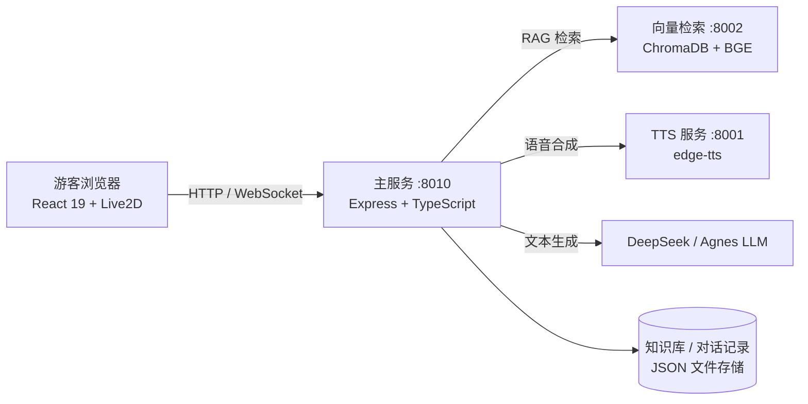

<div align="center">


# 🏯 灵山胜境 AI 数字人导游 · 灵小禅

**基于 RAG + 大语言模型的智慧景区 AI 导游系统，为灵山胜境提供数字人交互式导览服务**

[](https://github.com/freeze614/lingshan-ai-guide)
[](#-license-1)
[](https://nodejs.org)
[](https://www.python.org)
[](https://react.dev)
[](https://www.typescriptlang.org)

</div>

---

## 📖 项目简介

灵小禅是一个面向 **灵山胜境** 景区游客的 AI 数字人导游。游客通过文字或语音提问，系统基于景区知识库进行 **RAG 检索增强问答**，由大语言模型生成准确、有温度的回答，并通过 **TTS 语音播报** 与 **Live2D 数字人形象** 呈现。

同时提供 **管理后台**：对话记录审计、知识库管理、情感分析报告、热门问题统计、游客分布等运营数据一应俱全。

<!-- Add demo GIF here: use asciinema or screen-to-gif to record a QA conversation -->

## ✨ 核心特性

- 🤖 **RAG 智能问答** — 知识库分块 + 向量语义检索（ChromaDB + BGE 中文模型），支持流式输出
- 🗣️ **语音交互** — 语音输入识别 + 微软 Edge TTS 语音播报
- 👧 **Live2D 数字人** — 实时渲染数字人形象，支持口型同步与表情动作
- 🖼️ **图片识别** — 上传景点照片即可识别并讲解（多模态模型）
- 🗺️ **景点百科** — 内置 30+ 景点结构化数据，问答自动匹配景点图片
- 📍 **周边服务** — 位置推荐、附近设施查询、个性化游览路线推荐
- 💬 **情感分析** — 对游客对话进行情感标注，生成满意度运营报告
- 🛠️ **管理后台** — 知识库文档上传（docx/xlsx/txt）、索引重建、对话导出

## 🖥️ 系统架构



### 目录结构

<details>
<summary>📁 展开查看</summary>

```text
lingshan-ai-guide/
├── backend/            # Node.js + Express 主服务 (port 8010)
│   ├── src/            # TypeScript 源码（API / RAG / LLM / TTS / WebSocket）
│   └── python/         # Python 微服务（TTS / 向量检索 / ASR）+ requirements.txt
│       └── tools/      # 语料生成、口型生成、问答准确率评测脚本
├── frontend/           # React 19 + Vite + Ant Design (dev port 5173)
│   ├── src/            # visitor（游客端）/ admin（管理端）页面与组件
│   ├── public/         # 静态资源（Live2D 模型、景点图片）
│   └── dist/           # 前端构建产物（后端静态托管，不入库）
├── data/               # 运行时数据（知识库语料入库，其余不入库）
│   └── raw/            # RAG 原始语料，见 docs/knowledge-corpus.md
├── docs/               # 项目文档
├── scripts/            # start.bat / stop.bat 一键启动、停止脚本
└── .github/workflows/  # CI（前后端构建 + lint）
```

</details>

### 技术栈

| 层 | 技术 |
|------|------|
| 主服务 | Express 4 · TypeScript 5 · WebSocket · JWT · Helmet |
| 检索 | ChromaDB · sentence-transformers（BAAI/bge-large-zh-v1.5）|
| 语音 | edge-tts（微软 Edge 语音）· ASR 语音识别 |
| 前端 | React 19 · Vite · Ant Design 6 · pixi-live2d-display · Zustand · ECharts |

## 🚀 快速启动（Windows）

### 1. 环境要求

- **Node.js** ≥ 18（[下载 LTS 版](https://nodejs.org)）
- **Python** ≥ 3.10（[下载](https://www.python.org/downloads/)，安装时勾选 **Add Python to PATH**）
- Chrome 或 Edge 浏览器（语音功能需要）

### 2. 一键启动

双击 **`scripts/start.bat`**，脚本会自动：

1. 安装 backend / frontend 依赖（首次，约 3-5 分钟）
2. 构建前端产物（首次）
3. 安装 Python 依赖 `edge-tts chromadb sentence-transformers`
4. 依次启动 TTS → 向量检索 → 主服务
5. 自动打开浏览器访问 `http://localhost:8010`

**停止服务：** 双击 **`scripts/stop.bat`**。

### 3. 配置 API Key（首次必做）

⚠️ 未配置 API Key 时，问答和图片识别无法使用。

1. 复制根目录 `.env.example` 重命名为 `.env`
2. 将 `your-xxx-api-key-here` 替换为真实 Key：

| 变量 | 说明 | 获取方式 |
|------|------|----------|
| `DEEPSEEK_API_KEY` | DeepSeek 主力文本模型 Key | [platform.deepseek.com](https://platform.deepseek.com) |
| `DEEPSEEK_MODEL` | 主力文本模型 | 默认 `deepseek-chat` |
| `AGNES_API_KEY` | Agnes AI 多模态 + fallback Key | [agnes-ai.com](https://agnes-ai.com) |
| `AGNES_MODEL` | 多模态模型（图片识别） | 默认 `agnes-2.0-flash` |
| `AGNES_BASE_URL` | Agnes API 地址 | 默认 `https://apihub.agnes-ai.com/v1` |
| `PORT` | 主服务端口 | 默认 `8000` |
| `CORS_ORIGINS` | 跨域白名单 | 默认 `http://localhost:5173` |

## 🔧 手动启动（开发调试）

```bash
# 1. 安装依赖
npm --prefix backend install
npm --prefix frontend install

# 2. 安装 Python 依赖
pip install -r backend/python/requirements.txt

# 3. 构建前端
npm --prefix frontend run build

# 4. 启动 TTS 服务
cd backend && python python/tts_server.py

# 5. 启动向量检索服务（新终端）
cd backend && python python/vector_service.py

# 6. 启动主服务（新终端）
cd backend && npm run dev
```

访问 `http://localhost:8010`。

**前端热更新开发模式：**

```bash
cd frontend && npm run dev
# 访问 http://localhost:5173
```

## 📊 访问入口

| 页面 | 地址 | 说明 |
|------|------|------|
| 游客问答 | `http://localhost:8010` | 数字人导览主界面 |
| 管理后台登录 | `http://localhost:8010/admin/login` | 默认账号 `admin` / `lingshan2026` |

### 管理后台功能模块

| 模块 | 路径 | 说明 |
|------|------|------|
| 仪表盘 | `/admin/dashboard` | 查询量、活跃度、游客分布统计 |
| 对话记录 | `/admin/conversations` | 游客对话历史与导出 |
| 知识库 | `/admin/knowledge` | 文档上传、索引重建、问答测试 |
| 反馈分析 | `/admin/sentiment` | 情感分析报告、低满意问题排行 |
| 数字人配置 | `/admin/digital-human` | 形象与外观设置 |

### 核心 API（`/api/v1`）

| 方法 | 路径 | 说明 |
|------|------|------|
| `POST` | `/visitor/qa` | RAG 问答（支持流式） |
| `POST` | `/visitor/tts` | 文本转语音 |
| `POST` | `/visitor/vision/recognize` | 图片识别讲解 |
| `GET` | `/visitor/spots` | 景点列表 / 详情 |
| `POST` | `/visitor/recommend` | 游览路线推荐 |
| `GET` | `/visitor/nearby-facilities` | 附近设施查询 |
| `POST` | `/admin/knowledge/documents` | 上传知识库文档 |
| `GET` | `/admin/dashboard/summary` | 运营统计 |

完整接口见 `backend/src/api/v1/`，健康检查：`GET /health`。

## 🤝 Contributing

欢迎提交 Issue 与 Pull Request。请先 Fork 仓库，基于特性分支开发，提交前运行 `npm run lint` 确保代码风格一致。

## 📄 License

本项目基于 **MIT** 协议开源。

## ⭐ Star History

如果这个项目对你有帮助，欢迎点一个 Star！

[](https://star-history.com/#freeze614/lingshan-ai-guide&Date)
